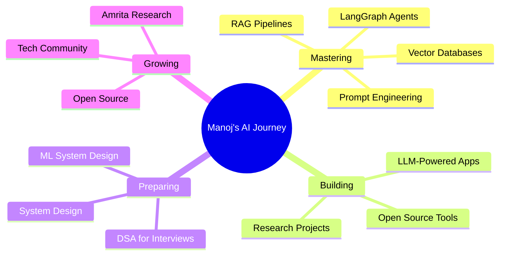

<div align="center">

<!-- Animated Header -->


</div>

<div align="center">

[](https://linkedin.com/in/manojkothakota)
[](https://github.com/manojkothakota)
[](mailto:your@email.com)
[](https://leetcode.com/manojkothakota)


</div>

---

## 🧠 About Me

```python
manoj = {
    "name"      : "Kothakota Manoj",
    "location"  : "India 🇮🇳",
    "education" : "B.Tech CSE-AI (3rd Year) @ Amrita Vishwa Vidyapeetham",
    "focus"     : ["LLMs", "RAG Systems", "LangChain", "LangGraph", "Agentic AI"],
    "building"  : "Intelligent AI systems that reason, retrieve & respond",
    "learning"  : ["Multi-Agent Frameworks", "Vector Databases", "MLOps"],
    "goal"      : "SDE / ML Engineer @ Product Company | Class of 2027",
    "superpower": "Turning complex AI research into working systems 🔬→💻",
    "fun_fact"  : "I think in RAG pipelines and dream in embeddings 😄",
    "open_to"   : ["Collaborations", "Research", "Internships", "Open Source"]
}
```


### 🚀 What Drives Me

- 🤖 **LLM Engineer** — Building RAG pipelines, agents & fine-tuned models
- 🔗 **LangChain / LangGraph** — Designing multi-agent AI workflows
- 🔍 **Computer Vision & NLP** — Research-grade models for real-world problems
- 📊 **Data Science** — From raw data to actionable ML-driven insights
- 🧪 **Research-Minded** — Curious about what's next in Generative AI
- 🏆 **Placement Ready** — Targeting product companies with solid DSA + projects

<br clear="right"/>

---

## 🏅 Achievements & Recognition

<table>
<tr>
<td width="50%">

### 🎓 Education & Research
- 🎓 **B.Tech CSE-AI** @ Amrita Vishwa Vidyapeetham
- 📚 **CGPA:** [Your CGPA] (add if strong — 8+)
- 📄 **Research Project:** [Your project name/domain]
- 🔬 Active contributor to academic AI research

</td>
<td width="50%">

### 📜 Certifications
- ✅ [Coursera / Google / AWS Cert Name]
- ✅ [Another Certification]
- ✅ [Add all your certs here]
- ✅ Internship @ [Company Name]
- ✅ Open Source Contributor

</td>
</tr>
<tr>
<td colspan="2">

### 🌐 Community & Experience
- 💼 **Internship** @ [Company Name] — [Brief what you did]
- 👥 Active in AI/ML communities at Amrita
- 🧑‍💻 Open source contributions to [repo names]

</td>
</tr>
</table>

---

## 💼 Featured Projects

<div align="center">

| Project | Description | Tech Stack | Links |
|---------|-------------|------------|-------|
| 🔍 **RAG Document QA System** | Multi-doc Q&A with source citations using retrieval-augmented generation | LangChain · FAISS · OpenAI · Python | [Repo →](https://github.com/manojkothakota) |
| 🤖 **Multi-Agent AI Workflow** | Stateful agentic system for complex reasoning & tool-use using LangGraph | LangGraph · LLMs · Python | [Repo →](https://github.com/manojkothakota) |
| 🧬 **[Research Project Name]** | Academic research applying deep learning to [your domain] at Amrita | PyTorch · HuggingFace · [Domain] | [Repo →](https://github.com/manojkothakota) |
| 📊 **[Data Science Project]** | End-to-end ML pipeline from data cleaning to deployment | Pandas · Scikit-learn · SQL | [Repo →](https://github.com/manojkothakota) |
| 🌐 **[Web App Project]** | Full-stack application with AI-powered features | React · Node.js · MongoDB | [Repo →](https://github.com/manojkothakota) |

</div>

> 💡 *Each project has detailed documentation, architecture diagrams, and setup guides — click to explore!*

---

## 🛠️ Tech Arsenal

<div align="center">

### 🤖 AI / ML / LLM Stack


### 📊 Data Science & Analytics


### 🌐 Web Development


### ⚙️ Tools & Platforms


</div>

---

## 📊 GitHub Analytics

<div align="center">


</div>

---

## 🏆 GitHub Trophies

<div align="center">

[](https://github.com/ryo-ma/github-profile-trophy)

</div>

---

## 🐍 Contribution Snake

<div align="center">


</div>

---

## 🎯 Current Roadmap



---

## 💭 Dev Quote

<div align="center">


</div>

---

## 🤝 Let's Connect!

<div align="center">

I'm always open to discussing AI research, LLM systems, or building something impactful together!

### 📬 Reach Out

[](https://linkedin.com/in/manojkothakota)
[](mailto:your@email.com)
[](https://github.com/manojkothakota)
[](https://leetcode.com/manojkothakota)

### 💼 Open For

- 🤖 AI/ML Research Collaborations
- 💻 SDE / ML Engineer Roles (2026/27)
- 🧪 Research Internships
- 🔗 LLM & RAG Project Collaborations
- 📚 Knowledge Sharing & Mentorship

</div>

---

<div align="center">

### 🌟 *"Build AI systems that don't just predict — they understand."*

**Thanks for stopping by! Let's build the future of AI together 🚀**


</div>

---

<div align="center">

**Crafted with 🤖, ☕, and deep curiosity by Kothakota Manoj**


*Last Updated: June 2026*

</div>
